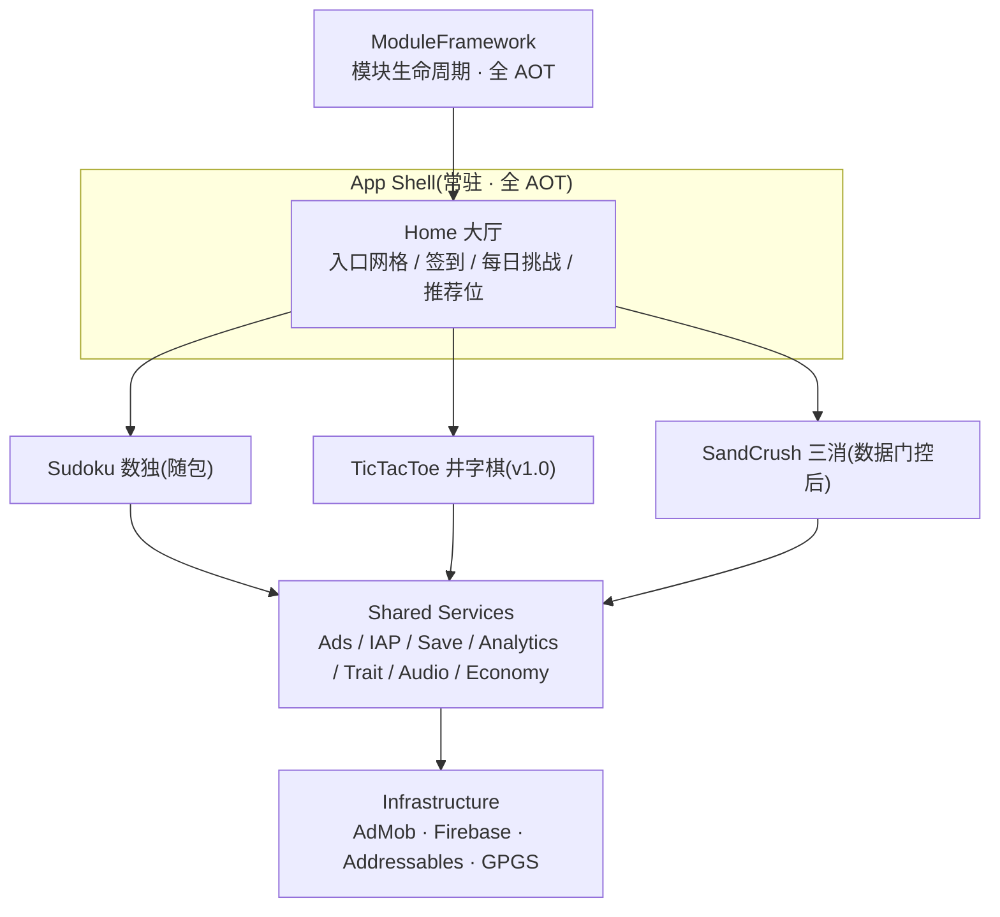

# SudokuGameBox · 数独游戏盒子

> 一个包、N 个玩法、一个运营中枢 —— 面向 Google Play 海外的休闲益智「游戏盒子」。
> 引擎:**Unity `6000.3.20f1`(国际版)** | 语言:C#(IL2CPP) | 平台:Android

**架构权威方案**:[docs/11_Unity游戏盒子架构方案.md](./docs/11_Unity游戏盒子架构方案.md)(v2.2)
**文档总览与导航**:[docs/README.md](./docs/README.md)

---

## 为什么是「盒子」

盒子形态的本质:**一个安装包,承载多个轻量玩法,共享一套运营中枢** —— 玩家在 A 玩法赚的金币能在 B 玩法花;运营侧通过服务端开关(Trait)随时调整体验;新玩法通过热更下发而**无需重新发版**。



每个玩法 = **独立程序集 + 独立 Addressables Group**,可单独热更、单独下架,模块之间零耦合。

---

## 技术栈

| 领域 | 选型 | 说明 |
|---|---|---|
| 引擎 | Unity `6000.3.20f1` 国际版 | D-12 定版;旧基线 `2022.3.50f1c1` 保留至迁移验收通过 |
| UI | UGUI + TextMeshPro(Unity 6 并入 ugui 2.x)+ 自研薄层 `UIKit` | 界面栈 / 弹窗互斥 / 生命周期,全 AOT(D-11) |
| 资源 | Addressables | 按需下载 + 远程热更**单通道**(D-1) |
| DI / 异步 | VContainer / UniTask(R3 后置) | 玩法与共享服务只经接口交互 |
| 代码热更 | HybridCLR(两阶段:v1.0 纯 AOT → v1.1 解释执行) | D-2 |
| 运营开关 | Trait 体系(AOT 框架 + 热更 Trait 子类 + 远程 JSON) | D-3 / D-6 |
| 广告 / 分析 | AdMob(单栈,留聚合位)/ Firebase(Analytics + RC + Crashlytics) | D-9 |
| 货币 | 全盒子唯一货币 `box.coins` | D-5 |
| 存档 | 单文件 AES-GCM + HMAC,按模块分区 | D-7 |

---

## 关键决策台账(摘要)

| # | 决策 | 结论 |
|---|---|---|
| D-1 | 热更下发通道 | Addressables Remote Catalog 单通道,禁止自建缓存 |
| D-2 | v1.0 构建模式 | 程序集按盒子拆分,但 v1.0 全 AOT 随包,**不启用解释执行** |
| D-4 | v1.0 玩法数量 | 大厅 + 数独 + 井字棋(第 3 个玩法进数据门控) |
| D-5 | 跨玩法经济 | 全盒子唯一货币 `box.coins` |
| D-6 | 配置通道 | 四分管:RC 只放紧急开关,业务配置走 CDN JSON |
| D-7 | 存档形态 | 按模块分区的单文件加密存档,提供 v0→v1 迁移 |
| D-10 | 架构文档入库 | 脱敏后入库,演进留痕 |
| D-11 | UI 框架 | 不引入全家桶框架,自研 600~900 行 `UIKit` 薄层 |
| D-12 | 引擎版本 | Unity `6000.3.20f1` 国际版(2026-08-20 定版) |
| D-13 | minSdk | 统一为 24(Android 7.0) |

完整台账与待拍板项见 [11 号方案 §0](./docs/11_Unity游戏盒子架构方案.md)。

---

## 玩法规划

- **v1.0(上架)**:大厅 + 数独 + 井字棋,自包含纯 AOT,无网可完整玩
- **v1.1(热更启用)**:HybridCLR 解释执行 + 远程关卡 / 玩法下发 + dll 回滚
- **数据门控(G2)**:大厅 → 第二玩法进入率 ≥ 15% 才做第 3 个玩法(止损线,见 11 号 §12.3)

---

## 仓库结构

```text
docs/           # 产品 / 设计 / 架构 / 商业化 / 合规等全套文档(权威方案见 11 号)
GameBox/        # Unity 工程(当前为 2022.3.50f1c1 数独工程,按 11 号 §4.9 迁移)
```

---

## 路线图摘要

`P-1 前置(引擎迁移 + 工程债务清理,2~2.5 周)` → `P0-a 基础设施` → `P0-b 盒子骨架(ModuleFramework + UIKit)` → `P1 Trait 运行时` → `P2 第二玩法` → **`v1.0 上架`** → `P3 热更启用(v1.1)` → `P4 商业化完整化` → `P5(数据门控可选)`

净开发 10.5~12 周 + 25% 缓冲 = **13~16 周**。详见 [11 号方案 §12](./docs/11_Unity游戏盒子架构方案.md) 与 [06_项目路线图.md](./docs/06_项目路线图.md)。

---

## 文档导航

全部文档清单与推荐阅读顺序见 [docs/README.md](./docs/README.md)。
